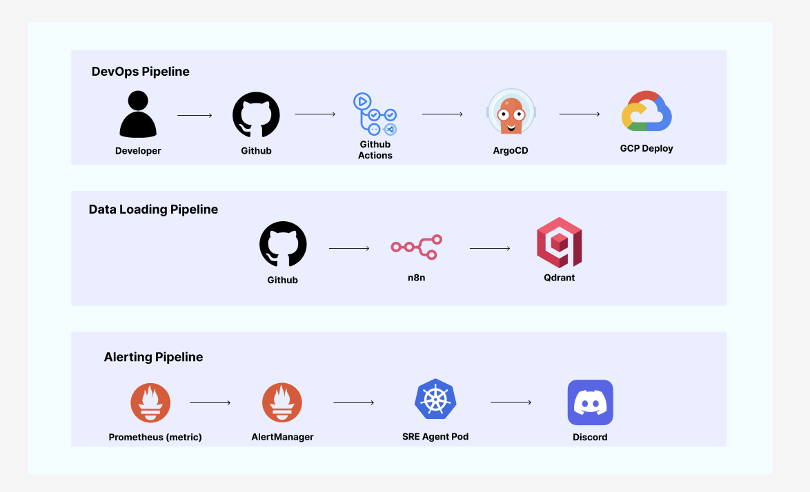

# 우리 FIS 아카데미 2차 기술 세미나 - AgentOps: 지능형 SRE 에이전트 플랫폼

> **AgentOps** — ArgoCD / Kubernetes 운영 중 발생하는 장애를 실시간 감지·분석하고, Discord로 해결책을 리포트하는 **지능형 SRE 에이전트 플랫폼**입니다.
> 고도화된 **Traefik 인그레스, HA 파드 구성, 정제된 모니터링 알람**이 통합된 인프라 환경을 지향합니다.

GCP GKE + Traefik Ingress + GitOps(ArgoCD) + n8n 지식 자동화

---

## 목차
1. [플랫폼 아키텍처 (논리/물리)](#플랫폼-아키텍처-논리물리)
2. [상세 구성 요소 및 역할](#상세-구성-요소-및-역할)
3. [AgentOps 파이프라인](#agentops-파이프라인)
4. [네트워크 및 보안 설계](#네트워크-및-보안-설계)
5. [운영 및 모니터링](#운영-및-모니터링)
6. [트러블슈팅 및 가이드](#트러블슈팅-및-가이드)

---

## 쿠버네티스 아키텍처 (논리/물리)

시스템의 서비스 흐름(논리)과 실제 서버 기반의 배치(물리)를 통합하여 관리합니다.

### 1.1 논리 아키텍처 (Logical Overview)

- **설명**: 네임스페이스 기반의 서비스 격리와 트래픽 라우팅, 그리고 지식 검색(RAG) 흐름을 보여줍니다.
- **특징**: n8n을 통한 자동 지식 적재와 SRE 에이전트의 분석 루프가 핵심입니다.

### 1.2 물리 아키텍처 (Physical Overview)

- **설명**: GKE 클러스터 내 2개의 워커 노드에 파드들이 어떻게 분산 배치되어 있는지를 보여줍니다.
- **특징**: `podAntiAffinity`를 통한 에이전트 분산과 각 파드별 전용 GCP Persistent Disk(PD) 연결을 시각화했습니다.

---

## 상세 구성 요소 및 역할

### 1. Ingress & Traffic Control
- **Traefik v3**: 
    - 클러스터 외부 진입을 관리하는 현대적인 리버스 프록시 모든 서비스 트레픽을 단일 엔트리포인트로 통합
    - 전용 대시보드를 통해 실시간 라우팅 상태를 시각적으로 모니터링

### 2. SRE Discovery Agent
- **FastAPI / LangGraph**: 
    - 에이전트의 중추 역할을 수행하며 Prometheus 장애 컨텍스트를 분석하여 대응
    - 파드 2개(HA) 구성으로 인프라 장애 시에도 분석 업무를 지속

### 3. Knowledge Storage & Pipeline
- **Qdrant (Vector DB)**: K8s 트러블슈팅 지식을 고차원 벡터로 저장하며 영구 디스크(PD)로 데이터를 보호
- **n8n Automation**: 깃허브 레포지토리의 `data/` 폴더를 주기적으로 크롤링하여 최신 지식을 Qdrant에 적재

### 4. Observability Stack
- **Prometheus / AlertManager**: 실시간 메트릭 수집 및 핵심 장애 발생 시 SRE 에이전트 트리거를 담당
- **Grafana**: 전용 대시보드(ID: 3119)를 통해 클러스터 리소스 사용량을 실시간 관측

---

## AgentOps 파이프라인

본 플랫폼은 세 가지 핵심 루프를 통해 자동화된 운영 환경을 완성합니다.

1.  **DevOps Loop**: CI(Eval) -> ArgoCD를 통한 안정적인 무중단 배포 루프
2.  **Knowledge Loop**: n8n -> Qdrant 지식 데이터 정시 적재 루프
3.  **Incident Loop**: 장애 감지 -> 분석(RAG) -> 소통(Discord) 대응 루프

---

## 네트워크 및 보안 설계

서비스 안정성과 데이터 보안을 위해 트래픽 접근 권한을 계층적으로 분리했습니다.

| 컴포넌트 | 서비스 타입 | 접근 방식 | 보안 이유 |
| :--- | :--- | :--- | :--- |
| **Traefik Ingress** | `LoadBalancer` | 인터넷 공인 IP (80/443) | 모든 트래픽의 보안 단일 관문 (EntryPoint) |
| **SRE Agent API** | `ClusterIP` | Traefik / IngressRoute | 인그레스를 통한 L7 라우팅 및 인증 계층 적용 |
| **Admin UI (Grafana, n8n)** | `ClusterIP` | `kubectl port-forward` | 보안상 인증된 관리자만 로컬 세션으로 접근 |

---

## 운영 및 모니터링

### 스마트 알림 정책
GKE 환경의 노이즈 알람을 필터링하고 실제 조치가 필요한 항목만 전달합니다.
- **Watchdog 필터링**: 불필요한 테스트 알람 자동 차단
- **핵심 장애 감지**: NodeDown, PodCrashLoop 등 크리티컬 이슈 집중 모니터링

### Grafana 대시보드
- **ID**: 3119 (Kubernetes Cluster Monitoring)
- **계정**: `admin` / `1q2w3e4r!@` (설치 시 자동 반영)

---

## 트러블슈팅 및 가이드

**1. CI 환경에서 에이전트 평가 점수가 낮은 경우**
- `observability/golden_set.json` 및 Qdrant 데이터 연관성 확인이 필요합니다.

**2. Traefik 대시보드 접속 불가**
- `kubectl port-forward -n traefik ... 9000:9000` 명령어를 확인하세요.

**3. 데이터 유실 발생 시**
- GCP PVC 상태(`Bound`) 및 스토리지 클래스 설정을 점검하세요.