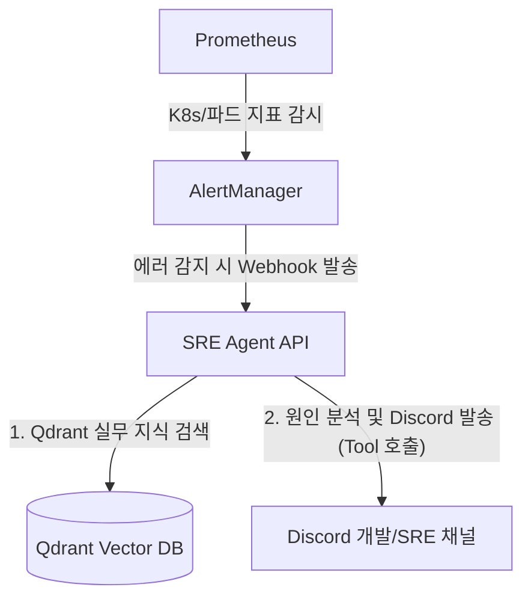

# 🤖 우리 FISA 클라우드 엔지니어링 6기 기술 세미나

> **AgentOps** — AI 에이전트를 GitOps 기반 완전 관리형 인프라에 배포/운영하는 플랫폼
> (GCP K8s + n8n 완전 클라우드 자동화 구조 적용)

ArgoCD / Kubernetes 운영 중 발생하는 에러 로그를 분석하고, 공식 문서·과거 사례를 기반으로 해결책을 제시하는 **SRE 에이전트**입니다.

이 시스템의 핵심은 단순한 RAG 봇이 아니라, **에이전트를 어떻게 배포하고, 데이터를 어떻게 최신화하며(n8n 클라우드 내부망 통신), 퀄리티를 평가(Eval)하는지 보여주는 "AgentOps"의 완성형 무선망 파이프라인**을 띄우는 것에 있습니다.

---

## 📌 전체 아키텍처 (GCP GKE + 자동화 인프라)

```
[인터넷 / 사내망 오픈]                    [GCP GKE 클러스터 내부 (sre-agent Ns)]
 LoadBalancer (80)     →        API 에이전트 (Pod)
                           (인터넷 차단 내부통신 ↓ API 호출: http://qdrant-svc:6333)
                              Qdrant DB (Pod) ←동적 마운트→ [GCP 영구 디스크 5GB]
                           (인터넷 차단 내부통신 ↑ 문서 적재: http://qdrant-svc:6333)
 Port-Forward (5678)   →        n8n 파이프라인 (Pod) ←동적 마운트→ [GCP 영구 디스크 5GB]
```

**✅ 왜 GCP 클라우드 내부에 에이전트 + Qdrant + n8n을 한 번에 배포했나요?**
1. **완벽한 데이터 자동화**: 노트북을 꺼도 새벽마다 클라우드 안(n8n Pod)에서 `kubernetes.io` 공식 문서를 자동으로 크롤링/임베딩해 옆 파드(Qdrant)에 꽂아 넣습니다.
2. **비용 효율 및 안정성**: 영구 볼륨(Persistent Disk)을 엮어 노드가 재부팅되어도 벡터 데이터가 1원도 유실되지 않습니다.
3. **실시간 관측 (Observability)**: Langfuse Cloud를 사용하여 클러스터 외부에서도 LLM 비용, 레이턴시, 답변 품질을 실시간으로 모니터링합니다.

---

## 🚨 SRE 무인 자동화 파이프라인 (Pro-active Monitoring & Reporting)

기존의 사용자가 찌르면 답하는 챗봇 형태(Re-active)를 뛰어넘어, 인프라 장애를 스스로 감지하고 해결책을 슬랙으로 보고하는 **양방향(Pro-active) SRE 에이전트 아키텍처**입니다.



**✅ 완전 자동화 시나리오 흐름**
1. **[인프라 감시]** K8s 클러스터 내의 Prometheus & AlertManager가 파드의 OOMKilled, CrashLoopBackOff 등의 치명적 에러를 실시간으로 감지합니다.
2. **[에이전트 기상]** AlertManager가 장애 로그를 담아 SRE 에이전트의 API Webhook을 찌릅니다.
3. **[원인 분석]** 잠에서 깬 에이전트(LangGraph)가 Qdrant에 적재된 K8s/ArgoCD/Terraform 실무 지식을 검색하여 에러의 근본 원인과 해결 코드를 파악합니다.
4. **[능동적 Discord 보고 🔫]** 에이전트가 자기 손으로 직접 **Discord Webhook Tool(에이전트 무기)** 을 꺼내어, 단순 에러 알람이 아닌 **"정확한 원인과 인프라 조치 방법이 포함된 사고 브리핑 리포트"** 를 사내 디스코드 방에 즉시 전송합니다.

---

## 🛡️ 네트워크 보안 설계 (Zero Trust Architecture)

포트폴리오에서 강조할 만한 **실무 수준의 네트워크 격리 및 접근 제어 전략**을 적용했습니다.

| 컴포넌트 | K8s 서비스 타입 | 접근 방식 | 보안 목적 |
|----------|-----------------|-----------|-----------|
| **SRE 에이전트 봇** | `LoadBalancer` | 인터넷 공인 IP 개방 (80 포트) | 슬랙/사용자가 챗봇 API에 직접 통신해야 하므로 유일하게 외부에 개방 |
| **Qdrant DB** | `ClusterIP` | K8s 내부망 통신 격리 | 인프라 지식이 담긴 핵심 데이터베이스이므로 외부 접속 원천 차단 |
| **n8n / ArgoCD** | `ClusterIP` | 🔒 `kubectl port-forward` | 해커의 비정상적 파이프라인 조작을 막기 위해 **로컬 인증된 관리자만 포트포워딩 방식**으로 UI에 접근 |

단순히 통신 구멍(Port)을 다 열어두는 장난감 프로젝트가 아니라, **"고객(User)이 맞닿는 API 컨테이너만 외부에 퍼블리시하고, 데이터를 다루는 백엔드 인프라는 쿠버네티스 내부 DNS(예: `http://qdrant-svc:6333`)로만 통신"** 하도록 설계된 안전한 클라우드 네이티브 환경입니다.

---

## 🛠️ 필요한 가이드

이 프로젝트는 **로컬 테스트**와 **완벽한 GCP 배포** 모두 가능합니다. 

- **빠르게 클라우드에 전체 인프라를 띄우고 싶다면**: 👉 [GCP GKE 배포 전체 라인 상세 가이드](deployment/README.md)
- **n8n 자동 파이프라인 구성이 궁금하다면**: 👉 [클라우드 백업 자동화 (n8n) 가이드](pipeline/README.md)
- **로컬에서 파이썬 에이전트 코드만 띄워보고 싶다면**: 아래 로컬 실행을 따라주세요.

---

## 🚀 로컬 개발환경 실행 가이드

> 배포가 아닌 순수 에이전트 봇 자체를 로컬에서 돌려보는 단계입니다.

### Step 1. 레포 클론 및 환경 설정

```bash
git clone https://github.com/nyongwan/fisa-ce6-agent-platform.git
cd fisa-ce6-agent-platform

# .env.example을 복사해서 .env 파일 생성
cp .env.example .env

# 파이썬 가상환경
python3 -m venv .venv
source .venv/bin/activate 

pip install -r requirements.txt
```

`.env` 파일을 열어서 필수 값 1개를 꼭 채웁니다:
```env
OPENAI_API_KEY=sk-...         # 필수: OpenAI API 키
QDRANT_URL=http://localhost:6333  # 로컬용 유지
```

### Step 2. 로컬용 Qdrant 실행 (컨테이너)
데이터베이스 역할을 할 벡터 DB입니다.
```bash
# Docker 또는 Podman
podman run -d --name qdrant \
  -p 6333:6333 \
  -v $(pwd)/qdrant_data:/qdrant/storage:Z \
  docker.io/qdrant/qdrant:v1.13.0
```
✅ 확인: http://localhost:6333/dashboard 접속되면 성공

### Step 3. 에이전트 로컬 실행

```bash
# 옵션 1: CLI 모드 (터미널에서 직접 물어보기)
python main.py

# 옵션 2: API 챗봇 서버 모드 
uvicorn agent.api:app --reload --port 8000
```

---

## 🔄 AgentOps 파이프라인 CI/CD 흐름

```
개발자의 Agent 프롬프트 / 코드 변경
    ↓
GitHub Push
    ↓
GitHub Actions
    ├── [Eval] 테스트 스크립트 실행 (품질 통과?)
    │       ├── 통과(Pass) → 이미지 빌드 후 GHCR 등재 
    │       └── 실패(Fail점수) → 즉시 배포 중단 ❌
    ↓
ArgoCD가 깃 변경 감지 → GKE 클러스터에 Sync
    ↓
Langfuse로 배포 이후 실시간 관측
    (비용 / 레이턴시 / 답변 품질 실시간 추적)
```

---

## 🛠️ 기술 스택

| 역할 | 기술 | 버전 |
|------|------|------|
| 클라우드 인프라 | **Google Cloud Platform (GKE)** | Standard / Autopilot |
| GitOps 배포 | [ArgoCD](https://argo-cd.readthedocs.io/) | latest |
| 데이터 파이프라인 | [n8n](https://n8n.io/) | latest |
| 에이전트 프레임워크 | [LangGraph](https://langchain-ai.github.io/langgraph/) | 0.2.x |
| 벡터 DB | [Qdrant](https://qdrant.tech/) | v1.13.x |
| 에이전트 관측 | [Langfuse](https://langfuse.com/) | 2.x |
| LLM | [OpenAI GPT-4o-mini](https://openai.com) | - |

---

## 🚨 트러블슈팅 (Troubleshooting)

이 프로젝트를 운영하며 겪은 주요 문제와 해결 방안입니다.

### 1. CI/CD 단계에서 평가 점수(Eval Score)가 0점이 나오는 문제
- **상태**: GitHub Actions 실행 시 Qdrant DB가 비어 있어 에이전트가 아무것도 검색하지 못함.
- **원인**: 테스트용 DB가 CI 환경에 독립적으로 존재하지 않았음.
- **해결**: `.github/workflows/ci.yml`에 **Qdrant Sidecar 서비스**를 추가하고, 평가 직전 `test_data.py`를 실행해 데이터를 자동 주입하도록 개선함.

### 2. GKE 배포 후 에이전트 답변 품질 저하
- **상태**: 클러스터에 갓 배포된 Qdrant는 지식이 없는 상태임.
- **해결**: 로컬에서 `kubectl port-forward`를 이용해 클라우드 Qdrant와 연결한 뒤, `test_data.py`를 실행하여 초기 지식(Golden Set 기반)을 수동 시딩함.

---

## 📌 참고 자료

- [Kubernetes 공식 문서](https://kubernetes.io/docs/)
- [LangGraph Agentic RAG 튜토리얼](https://langchain-ai.github.io/langgraph/tutorials/rag/langgraph_agentic_rag/)
